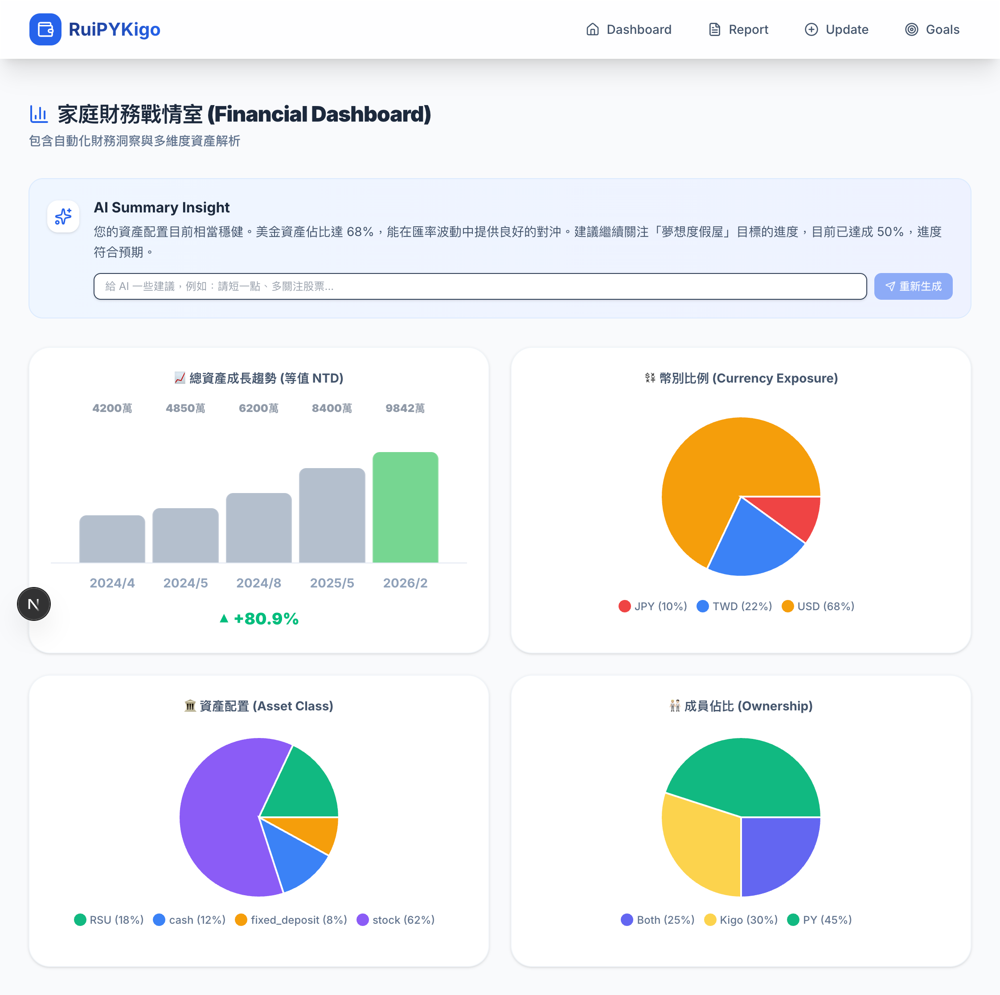

# PyKigo Finance Dashboard - Design Document

本文件詳細說明了 PyKigo Finance Dashboard 的系統架構、技術設計決策與資料模型。

## 1. 系統架構概念

專案採用現代化、非同步且數據驅動的架構，旨在處理多幣別資產與繁瑣的市場數據。

_架構概念圖：核心星狀結構與資料流。_

_註：本圖為實際 UI 介面展示 (使用模擬數據)。_

### 技術棧 (Tech Stack)
- **Frontend**: Next.js 15 (App Router) 提供高效的 Server Side Rendering 與 Client Side Interaction。
- **Styling**: Tailwind CSS 用於實現響應式與玻璃擬態 (Glassmorphism) 設計。
- **Charts**: Recharts 用於多維度金融數據視覺化。
- **Backend/Service**: Next.js Server Actions 模組化處理業務邏輯。
- **Security**: Next.js Middleware 實作全站密碼保護頁面；Supabase RLS 提供資料庫層級權限控管。
- **Mobile-First Design**: 採用底部導覽與置頂橫幅優化小螢幕操作體驗。
- **Database**: Supabase (Postgres) 提供即時數據存儲。SQL 管理腳本存放於 `supabase/scripts/`。
- **AI Engine**: Google Gemini 2.5 Flash (via `@google/genai`)。

---

## 2. 資料模型 (Data Model)
- **`assets`**: 資產定義表。包含：
  - `title`, `owner`, `asset_type`, `currency`, `ticker_symbol`.
  - `avg_cost`, `dividend_yield` (V1.2 新增：支援雪球預測)。
  - `strategy_category` (V1.2 新增：對應策略佔比)。
- **`snapshots` & `snapshot_records`**: 追蹤特定結算點的資產快照。
  - `quantity`, `unit_price`, `fx_rate`, `total_twd_value`.
- **`market_cache`**: 儲存最新市場報價與匯率。
- **`strategy_notes`** (V1.2 新增): 儲存個股戰術。
  - `ticker_symbol`, `note_content`, `target_buy_price`, `target_sell_price`, `confidence_level`.
- **`strategy_targets`** (V1.2 新增): 定義各類別理想佔比與色彩。
- **`goals`** & **`goal_asset_mapping`**: 特定財務目標（近期/長期）及其關聯資產。
  - `priority`: (V2.2) 儲存使用者自訂的顯示順序。
- **`user_goals`** (V1.2 新增): 總結性財務目標（如：月領 5 萬被動收入）。
- **`expense_categories`** (V2.0): 定義消費分類（如：餐飲、交通、裝修）。
- **`expenses`** (V2.0): 核心支出明細，支援 `paid_by` 與 `paid_for` 映射用於分帳結算。
- **`settlements`** (V2.0): 紀錄成員間的債務清償歷史。
- **`ai_summary_feedback`**: Gemini AI 回饋循環日誌。

---

## 3. 關鍵技術實作

### A. 互動式篩選機制 (Interactive Filtering)
儀表板透過 `useMemo` 實作 Client-side 篩選過濾器。當使用者點擊 Pie Chart 某個區塊（如：USD 幣別）時，系統會：
1. 更新全域 Filter 狀態。
2. 計算該分類在各月份結算點的佔比。
3. 同步更新 Trend Bar Chart 的堆疊 (Stacked Bar) 顯示，呈現篩選部分與總體資產的對比。

### B. AI 洞察回饋循環 (AI Feedback Loop)
系統不僅呈現一次性分析，更支援「訓練」：
- **Prompt Engineering**: AI Prompt 會注入當前資產比例數據。
- **Context Injection**: 每次生成會帶入最近 3 次的使用者回饋記錄。
- **Feedback Logging**: 紀錄使用者的修正指示，使 AI 能隨著使用時間越來越貼近使用者的財務觀點。

### C. 全自動市場同步 (Market Sync)
利用 **GitHub Actions** 每日定時觸發 Python 腳本 (`market_updater.py`)，透過 `yfinance` 抓取全球即時行情並寫回 Supabase 快取。

### D. 站點存取安全 (Option B Middleware)
針對正式版開發了自定義的安全層：
- **Middleware 攔截**：透過 `middleware.ts` 偵測 `site_auth` Cookie。
- **無縫 Demo 模式**：當 `NEXT_PUBLIC_DEMO_MODE` 為 `true` 時，系統自動跳過密碼驗證與 Supabase 初始化檢查，並透過 `@/lib/supabase` 提供穩定的 Mock Client 支援，確保 Demo 版本在無環境變數下也能順利 Build 與存取。

### E. 目標管理強化 (Goal Management CRUD)
從單純的「顯示」進化為「管理」：
- **雙向編輯**：支援從 UI 修改目標細節與重新勾選關聯資產。
- **權重與分層排序 (V2.2)**：
  - 實作了 JS 層級的混合排序演算法：`Category (Upcoming > Long-term) -> Priority (ASC)`。
  - 限制 UI 僅能在同一個類別內移動目標（Intra-category Reordering），確保分類結構穩定。
- **級聯刪除 (Cascading Cleanup)**：刪除目標時，系統自動清理映射表，確保資料庫一致性。

### F. 響應式優化與混合佈局 (V1.1 - V1.3 Evolution)
- **V1.1 — 行動優先**: 實作 `Bottom Navigation`、`Sticky Filter Banner` 與 Wizard 觸控優化。
- **V1.2 — 專業策略**: 整合 TradingView Widget 並實作 `strategy_notes` 持久化。
- **V1.3 — 混合佈局 (Hybrid Strategy)**:
  *   利用 Tailwind 斷點實作「電腦版三欄 (Sidebar-Chart-Notes)」與「手機版單欄堆疊」的自動切換。
  *   **手機版特化**: 將 Asset List 改為 `relative` 選單，拉升線圖高度至 `600px` 並將筆記設為常置底部。

### G. 智慧型資產搜尋與報價 (Smart Ticker Search)
- **多階段搜尋策略** (V1.1):
  1. **API 直連**：使用 `yahoo-finance2` 直連 Yahoo 搜尋建議 API。
  2. **自動補全**：台股輸入 4 碼純數字會自動補齊 `.TW` 或 `.TWS` 字尾。
  3. **Fallback 機制**：若搜尋結果為空或 API 超時，自動切換至內部常見股票列表 (`COMMON_STOCKS`)。

### H. 深度技術分析整合 (TradingView Integration) (V1.2)
- **動態 Widget 載入**：根據選取的 Ticker 自動映射 TradingView 格式 (如 `TPE:2330` -> `TWSE:2330`)，並載入深色主題分析組件。
- **持久化狀態**：利用 Server Actions 結合 Supabase 即時保存使用者的「戰術筆記」。

### I. AI 智慧帳務解析與去重 (AI Inbox) (V2.0)
- **權限與多模態解析**: 透過 Gemini 處理非結構化文字（載具、LINE 訊息）與視覺檔案（PDF 帳單、截圖）。
- **Token 優化去重邏輯**: 由傳統的「Prompt 內含歷史數據」進化為「Server-side JS 比對」。AI 僅負責解析，系統會自動在後台查閱最近 45 天數據進行模糊比對（金額 +/- 1, 日期 +/- 1天），大幅節省 AI Token 消耗並避免 429 額度錯誤。
- **批次處理機制**: 實作 Server-side 批次確認與刪除動作，優化大量核對時的效能。

### J. 分帳淨負債結算演算法 (V2.0)
- **債務模型**: 基於 `paid_by` (付款人) 與 `paid_for` (受益人) 的映射。
- **淨額邏輯**: 對沖雙方交叉墊付的金額，產生單一方向的應付帳款，並扣除已存在的 `settlements` 歷史紀錄以求得當前餘額。
- **部分結算支援**: 允許使用者自定義結算金額（不限於全額清償），系統自動更新累計債務狀態。

### K. 全歷史明細過濾引擎 (All Expenses Filtering) (V2.1)
- **多維度檢索**: 結合前端 `Search` 關鍵字與後端 `startDate/endDate` 參數。
- **過濾隔離 (Filter Isolation) (V2.2.4)**:
  - 針對 `isProjectTab` 或彈窗視角，強制將 `startDate/endDate` 設為空值（全歷史）。
  - 對伺服器 Action `getExpenseStats` 進行改造，使其在未傳入日期時自動返回全時期總計而非空值。
- **受益人與排版優化 (Paid For & Layout Opt) (V2.2.6)**:
  - **過濾邏輯**：Server Actions (`getExpenses`, `getExpenseStats`) 接受 `paid_for` 參數，動態過濾 SQL 查詢或 Demo Mock 資料。
移除冗餘 decorative text，提升了在行動裝置上的顯示空間，確保日期過濾器具有最高優先權。
- **全形校正**：使用 `toHalfWidth` 工具函式，在數據存入資料庫前強制規範化店家名稱字符。
- **解析備援策略**：`processAIImport` 實施了多層級解析：
    1. 優先使用 `gemini-2.0-flash-lite` 進行通用語法解析。
    2. 若遇到 429 Rate Limit 或解析錯誤，自動退避至內置的 Regex 規則引擎，處理標準銀行通知格式。
- **Demo 模擬支援**: 在 `getExpenses` Action 中實現了純 JS 版本的日期區間過濾邏輯，確保在無資料庫連接的展示環境下功能依然完整。
- **Session-based 穿透**: 針對剛確認的支出實作了 session 快取機制，使其能暫時無視全域月份篩選器而顯示在列表頂部，提供操作即時回饋。

---

## 4. Data Security & CI/CD
*   **History Sanitization**: Sensitive files (`data.csv`, certain SQL seeds) are purged from Git history using `filter-branch` to prevent accidental exposure via public repositories.
*   **Secret Management**: Production credentials (Supabase URL/Key) are managed via GitHub Actions Secrets, ensuring they are never hard-coded in the source code or `.env` files tracked by Git.
*   **Gemini AI Security**: All AI interactions use server-side actions with direct SDK calls, keeping API keys protected on the backend.

---

## 5. 安全性與擴充性

- **RLS (Row Level Security)**：資料庫層級的權限控管。
- **Wiki Sync SOP**：由於 GitHub Wiki 是獨立倉庫，修改主專案 `wiki/` 後必須執行 `node scripts/sync-wiki.mjs` 來同步至外部 Wiki 頁面。
- **模組化 UI**：Dashboard 拆分為 `AIInsightSection`, `TrendChart`, `AggregationPieCharts` 等，方便未來擴充圖表類型（如：散佈圖、熱點圖）。

---
**Created by Antigravity (AI Architect)**
