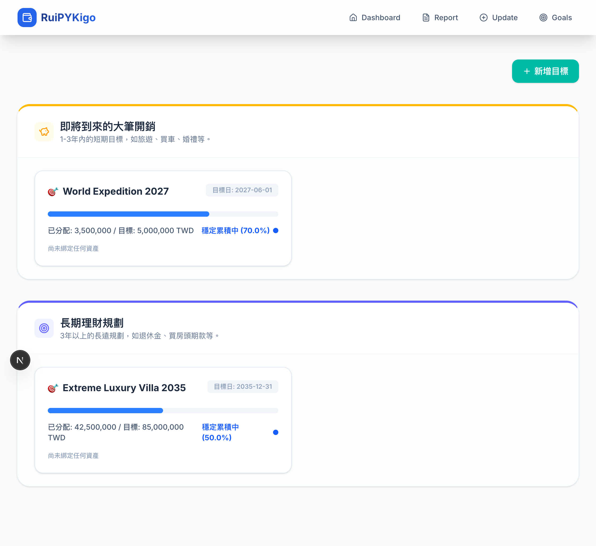
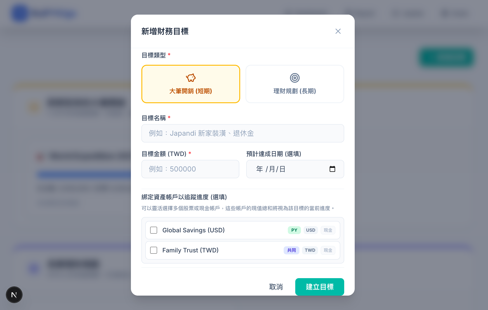
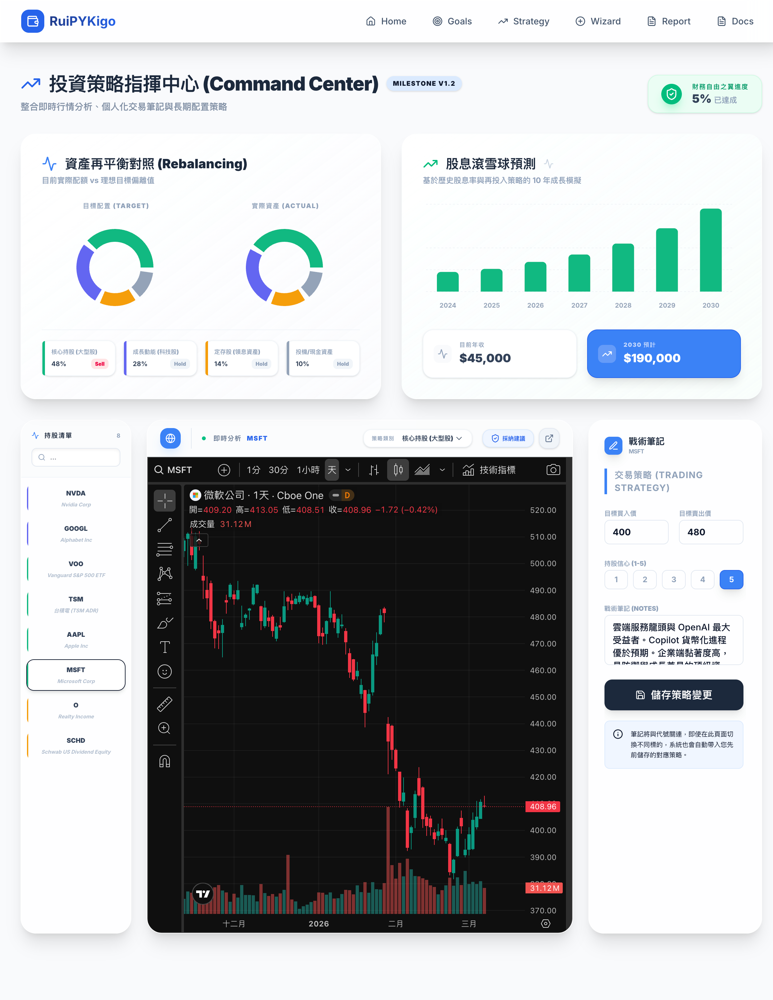
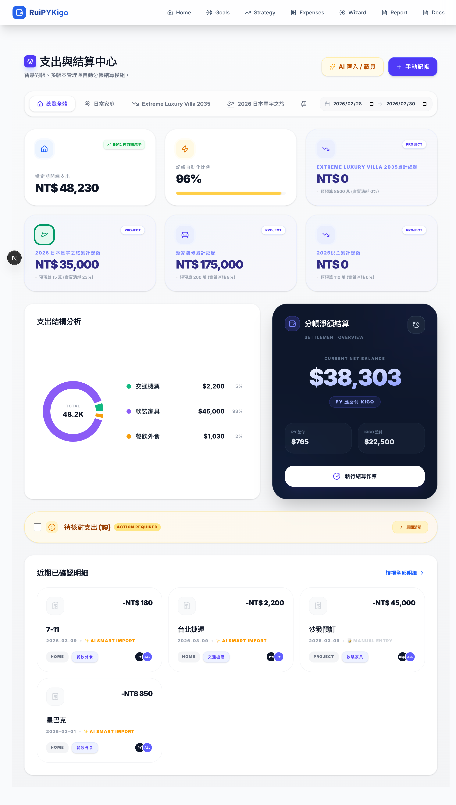
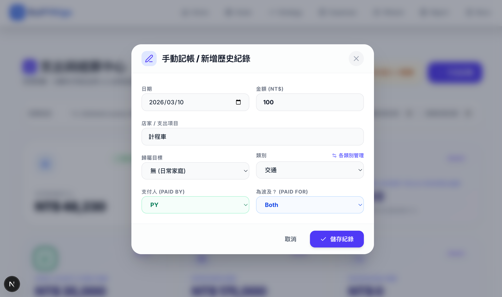
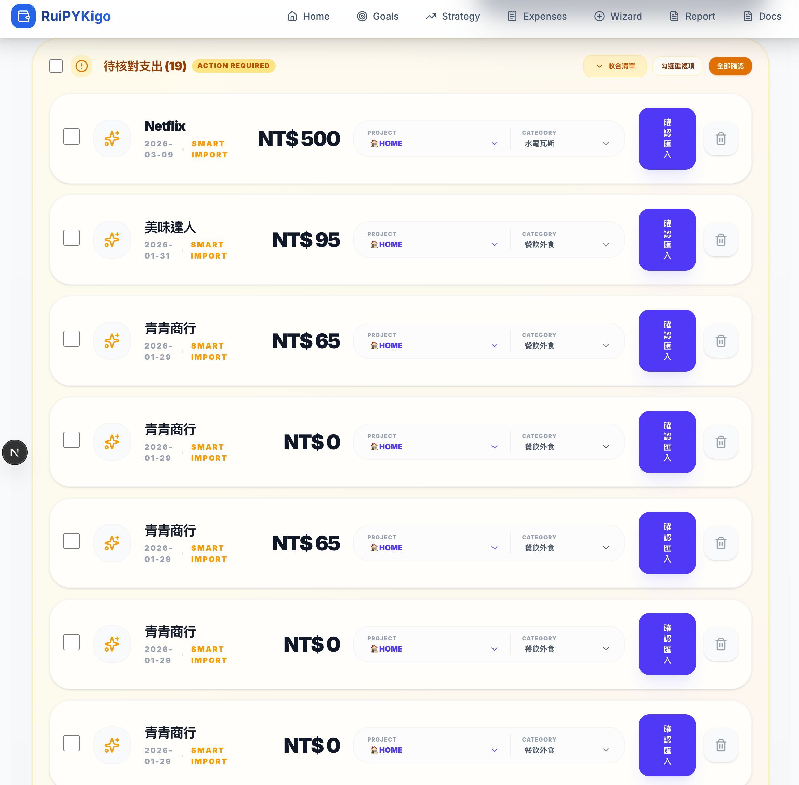
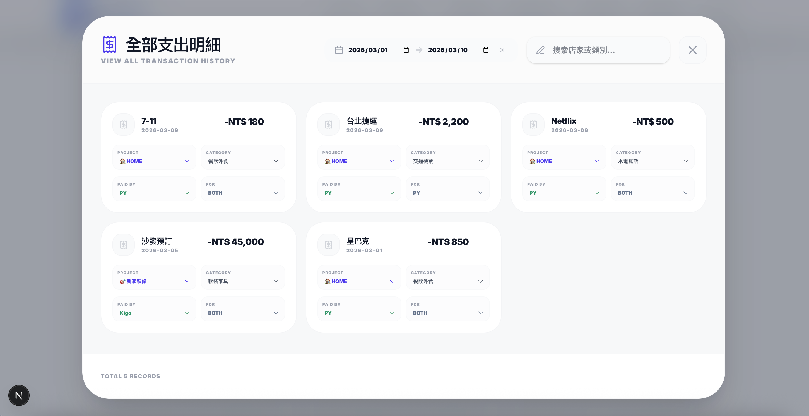
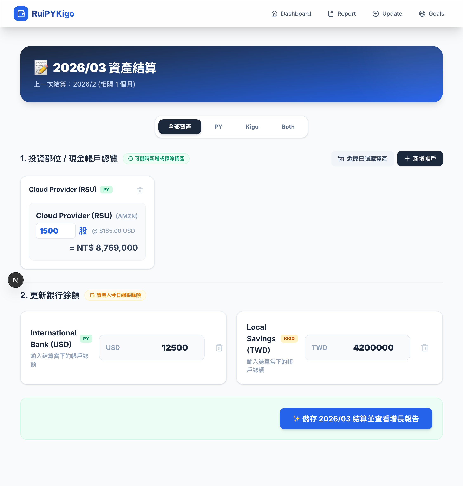
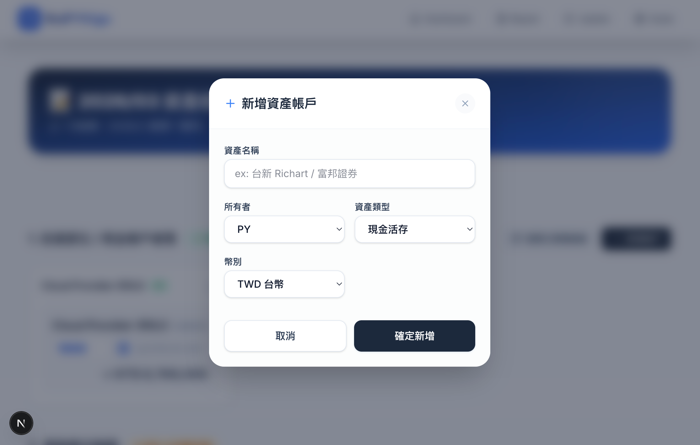
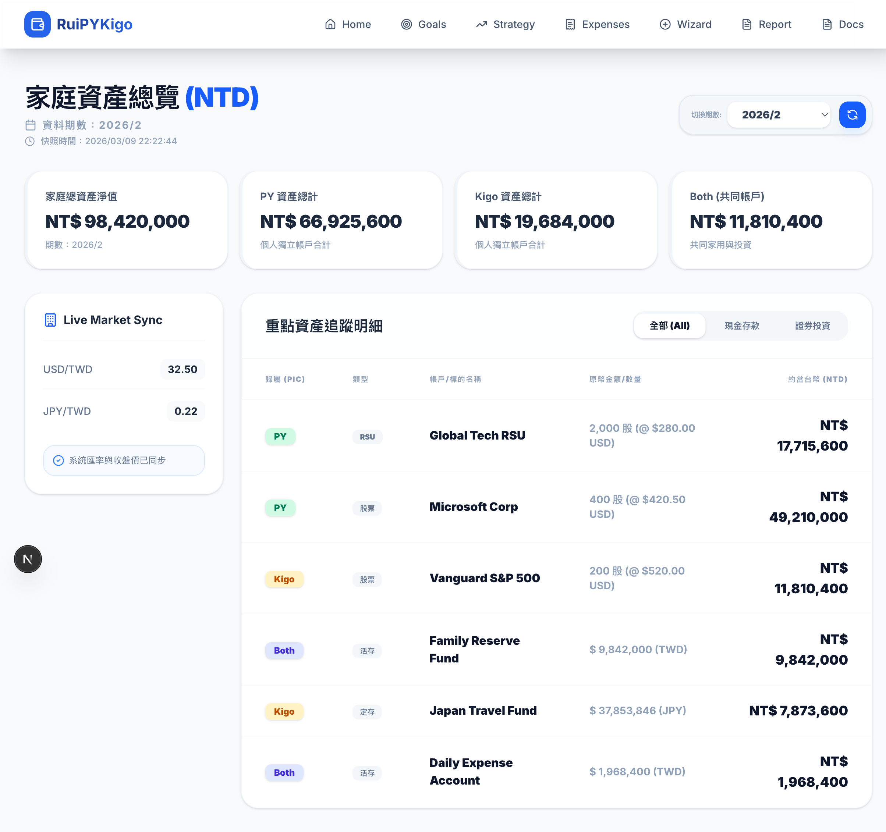

# PyKigo Finance Dashboard - 使用者操作指南

歡迎使用您的專屬財務戰情室！本指南將協助您快速上手各項核心功能。

## 0. 安全存取 (Site Security)
為了保護您的真實財務隱私，正式版設有密碼保護層。
- **登入頁面**：進入網頁後會自動跳轉至登入頁面。
- **輸入密碼**：請輸入由系統管理者（您自己）在 Vercel 環境變數 `SITE_PASSWORD` 設定的密碼。
- **記住身分**：登入成功後，瀏覽器會記住您的身分 30 天，期間內不需重複登入。
- **Demo 版免登入**：如果您分享的是 Demo 版本，系統會自動跳過此步驟，方便觀看模擬數據。

## 1. 財務戰情室 (Financial Dashboard)
儀表板提供全方位的資產視角。

- **AI 財務洞察 (AI Insight)**: 系統會根據最新數據自動產生一段分析。若您覺得 AI 說得不夠精確，可以在下方的回饋框輸入指令（例如：「請分析得更幽默一點」或「多關注我的美股分配」），點選「重新生成」。
- **趨勢互動圖表**: 
  - 點擊**總資產成長趨勢**中的月份長條圖，可以切換查看該月份的詳細分佈。
  - 點擊下方三個**分佈圓餅圖**（幣別、按所有人、按類型）的任一區塊，上方趨勢圖會自動顯示對應分類的「堆疊佔比」。
  - **行動版置頂篩選**：在手機上進行圓餅圖篩選時，上方會出現置頂橫幅顯示當前條件（例如：`幣別: USD`），讓您在下滑查看數據時也能隨時點擊「清除」鍵回到全局視野。

## 2. 財務目標追蹤 (Goal Tracker)
讓您的存款與投資賦予目標感。

- **設定目標**: 您可以建立「近期大筆開銷」（如：國內旅遊）或「長期理財規劃」（如：退休金）。
- **完整管理**: 
  - **編輯**: 點擊目標卡片右上角的「鉛筆」圖示，可隨時修改名稱、金額或重新勾選資產。
  - **刪除**: 點擊「垃圾桶」圖示並確認，即可移除不再追踪的目標。
- **資產關聯 (Asset Mapping)**: 建立或編輯目標時，下方會列出您的所有資產（股票、現金等）。勾選與該目標相關的帳戶，系統會根據這些帳戶的「目前淨值」自動加總，並即時計算目標達成率。
- **靈活配置**: 一個資產可以關聯至多個目標，或一個目標關聯多個資產，系統會自動在後台完成匯率轉換與價值計算。

## 3. 投資策略與規劃 (Strategy & Planning)
本頁面旨在協助您進行深度市場研究與投資紀律管理。

*電腦版：專業三欄式佈局，清單、圖表、筆記一目瞭然。*

- **資產再平衡 (Portfolio Rebalancing)**：
  - **目標 vs 實際**：系統會自動對比您設定的「理想配置比例」與「目前真實持股比例」。
  - **偏離提醒**：當某一分類的佔比偏離目標超過設定閥值時，系統會標示為 `Sell` (減碼) 或 `Buy` (加碼)，提醒您進行再平衡操作，以維持風險平衡。
  - **定義說明**：將鼠標懸停在比例卡片上，可查看該資產類別（核心、成長、定存、投機）的配置定義與建議。

- **股息滾雪球預測 (Dividend Snowball)**：
  - **基於真實持股**：根據您目前的股票與 RSU 庫存，自動計算預計的一年總股息。
  - **10 年複利模擬**：假設資產年增長與股息再投入率為 **12% (CAGR)**，系統會模擬未來 10 年的被動收入趨勢，讓您具體感受到被動收入的複利威力。
  - **進度追蹤**：右上角會顯示您目前的年股息已達成「財務自由目標」的百分比。

- **快速切換標的**：
  - **電腦版**：透過左側側邊欄進行搜尋與點選。
  - **手機版**：圖表上方配有專屬下拉選單，點擊後即可快速切換您名下的所有持股。
- **深度 K 線分析**：整合 TradingView 專業線圖，支援多種技術指標與畫線工具。我們為了手機螢幕拉升了線圖高度至 **`600px`**，確保視覺不壓迫且易於觀察趨勢。
- **交易筆記與戰略**：
  - 在圖表下方（手機版）或右側（電腦版）可以紀錄您的「目標價」、「預計賣出價」與「研究信心」。
  - 這些筆記會與特定股票代碼同步，並持久化儲存在資料庫中，方便您下次開啟同一標定時確認先前的分析。

## 4. 支出管理與 分帳結算 (V2.0)
本頁面旨在簡化繁瑣的日常記帳與家庭成員對帳。

- **AI 智慧匯入中心**:
  
  
  - **支援多格式**: 點擊「AI 匯入/載具」，可貼上電子載具文字、上傳 PDF 帳單或直接輸入內容。
  - **高效 2x2 排版**: AI Inbox 中的「支付人」與「對象」選擇器採用 2x2 矩陣排列，解決文字重疊問題，操作更直覺。
  - **多階段進度回饋**: 匯入時提供「分析中」、「儲存中」、「同步中」狀態，顯著提升操作透明度。
  - **批次快速設定 (Batch Default)**: 在收合選單頂部可一鍵同步所有待核對項目的歸屬，省去逐筆點擊。
  - **智慧去重**: 系統採用智慧去重技術，自動比對「日期、金額、商店」，若偵測到重複會顯示警告。
  
  - **自動化標籤**: AI 會自動判斷消費類別，並提供分類管理連結方便隨時調整。

- **全歷史明細彈窗 (All Expenses Modal)**:
  
  - 點擊「近期已確認明細」下方的「檢視全部明細」，會開啟全螢幕互動視窗。
  - **分層過濾系統 (Two-Row Filter)**:
    - 第一排：專屬專案/目標切換標籤。
    - 第二排：月份選擇器與精確日期區間。
    - 清楚劃分顯示範圍，讓篩選邏輯一目瞭然。
  - **全歷史明細過濾 (Date Filter)**: 提供精確的「開始」與「結束」日期選擇器，方便快速定位過往年度的特定消費。

- **分帳淨額結算模組**:
  
  - **墊付追蹤**: 顯示目前 PY 與 Kigo 的總墊付金額。系統採用「淨負債」邏輯，直接計算出誰應支付給誰。
  - **歸屬彈性**: 支援「Both」選項，適用於由共同資產直接支付且不列入分帳的情境。
  - **即時回饋**: 確認支出後，即使該筆支出屬於過往月份，也會暫時顯示在下方明細中，確保操作感連貫。

## 5. 定期資產結算 (Quarterly Wizard)
每次結算時（如：季度或月份），請前往此頁面。

- **確認投資股數**: 系統會自動帶入上一次的結算數量，並比對最新市場報價，您只需確認是否有買進/賣出即可。
    - **智慧代號搜尋**: 支援美股代號與台股代碼（如輸入 `0050` 會自動找尋 `0050.TW`）。若搜尋 API 暫時緩慢，系統會提供「熱門股票推薦」供您快速選取。
    - **防污染機制**:
        - 若處於 **Demo 模式**，資料僅會存於本地 UI 供預覽，不會寫入資料庫。
        - 若在正式版輸入包含 **"Test"** 的字眼，系統會跳出警告視窗確保您不是誤操作。
- **更新銀行餘額**: 填入各家網銀今日的實際餘額。
- **儲存結算**: 點擊儲存後，系統將自動計算等值台幣總額，並產生一份新的 AI 報告。

## 6. 歷史結算報告 (Report)
本頁面列出所有過往的結算細節，適合在報稅或年度回顧時使用，可以查看特定時間點所有帳戶的餘額快照。

## 7. 行動版介面優化 (Mobile Optimization)
為了讓您在手機上也能流暢更新資產，我們針對行動裝置進行了深度優化：

- **底部固定導覽選單**：支援單手操作，常用功能觸手可及（首頁、目標、策略、支出、結算、報告）。
- **置頂篩選橫幅**：Dashboard 的動作與篩選在手機版會自動置頂，方便在查看後方長列表時隨時清除狀態。
- **觸控優化**：所有輸入框、下拉選單與按鈕均經過放大處理，適配大拇指操作熱區。

---
---
> [!NOTE]
> **開發者筆記**：本專案已實現環境分離。開發環境所產生的任何「測試結算」或「假資料」均不會同步至正式版，請放心使用。

**Happy Financial Planning!**
